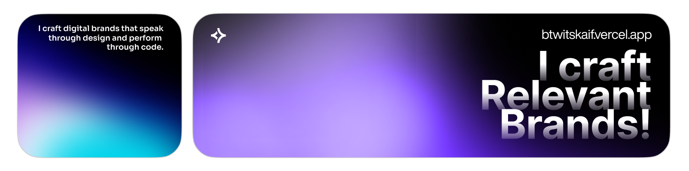

# Hello World!, I'm Kaif, an Indian Web Developer 👋🏼:
🛜 currently working on my project [skill set](https://skill-set-app.vercel.app)
 👨🏼‍🎓 Pursuing Bachelor of Computer Applications (BCA) at Indira Gandhi National Open University (IGNOU) 👨🏼‍💻  Aspiring developer, exploring the world of tech 

# 💻 Tech Stack:
                       

<picture>
  <source media="(prefers-color-scheme: dark)" srcset="https://raw.githubusercontent.com/btwitskaif69/btwitskaif69/output/github-snake-dark.svg" />
  <source media="(prefers-color-scheme: light)" srcset="https://raw.githubusercontent.com/btwitskaif69/btwitskaif69/output/github-snake.svg" />
  
</picture>

<!-- Proudly created with GPRM ( https://gprm.itsvg.in ) -->
